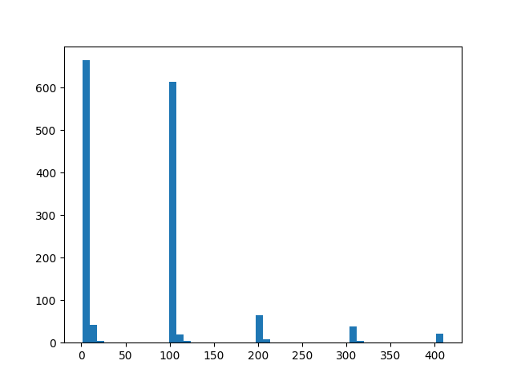
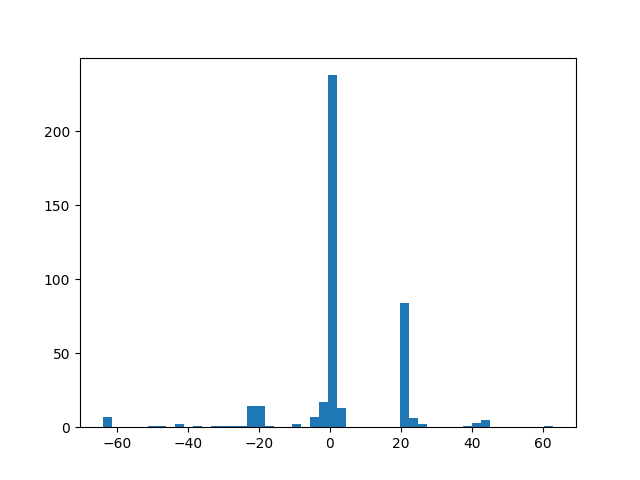
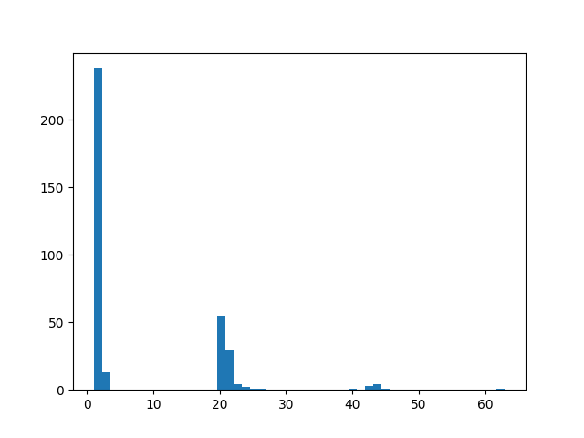

# STG(弹幕射击游戏)AI

## 数据分布

1wstep+evaluate,
一共产生了12385个score增量（判断奖励的部分），其中除去0只剩下1731条数据，再除去500以上的增量（极端情况最高3w但是很少），还剩下1486条数据，这1486条（1~
500）数据的分布大概是这样的



power的话比较特殊，总共也是12385条数据，除去0
只剩下424条数据，分布大概如上，这424条有增有减，减的情况是放大x或者死去（失去所有power）而这两种情况都有特殊的reward逻辑，所以只考虑增的情况有353条，其中251条123（对应自己捡的power），92条20左右40以下的（我猜大概是放大拿到的），10条40以上的（死了之后亲空全屏弹幕得到很多power）




上面这个是power增加的分布


## 保存的模型环境

== SAVED MODEL SYSTEM INFO ==

- OS: Windows-10-10.0.22631-SP0 10.0.22631
- Python: 3.8.16
- Stable-Baselines3: 1.8.0
- PyTorch: 1.11.0
- GPU Enabled: True
- Numpy: 1.23.5
- Gym: 0.21.0

## reward思路

放大扣分
死亡扣多
鼓励移动


## 待办

- [ ] 调参数 改操作游戏逻辑
- [ ] 找到合适的reward
- [ ] 换cnnpolicy参数

## 优化方向

- [ ] gamedata部分使用原生numpy数组而非对象以减少开销
- [x] sendinput()减少输入延迟
- [ ] 使用取色脚本或者图像识别进行正确的游戏重置操作
- [ ] 代码重构 常量整理到文件中

## 查看log信息

```bash
conda activate touhou
tensorboard --logdir .\log\tensorboard\  查看log
```

## 环境安装

```bash
conda create -n touhou python=3.8.16
conda activate touhou

conda install pytorch==1.11.0 torchvision==0.12.0 torchaudio==0.11.0 cudatoolkit=11.3

pip install psutil
pip install pywin32 # 可以不用
pip install pydirectinput 
pip install stable_baselines3
```

## 运行

